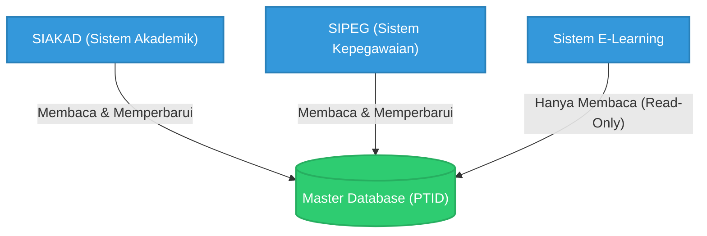

# Prinsip Satu Data (Single Source of Truth)

Mengadopsi semangat regulasi Satu Data Indonesia, IAIN Pontianak menerapkan prinsip **"Satu Sumber Kebenaran" (*Single Source of Truth* / SSOT)** sebagai fondasi utama tata kelola sistem informasinya.

## Implementasi Prinsip SSOT:
1. **Sentralisasi Data Master:** Setiap entitas entitas dasar institusi (seperti Data Mahasiswa, Data Pegawai, dan Data Program Studi) hanya diinisiasi dan diubah pada satu pangkalan data utama. 
2. **Sistem Terdistribusi namun Terhubung:** Aplikasi operasional yang bersifat spesifik (contoh: Sistem E-Learning atau Sistem Pengabdian) tidak boleh menyimpan duplikasi data master yang independen. Sistem tersebut wajib mengambil profil *user* atau entitas terkait langsung dari pangkalan data pusat melalui perantara *API Gateway*.
3. **Penyelesaian Konflik Data:** Apabila ditemukan ketidaksesuaian data (inkonsistensi) antara aplikasi pelaporan dan pangkalan data utama, maka nilai kebenaran mutlak mengacu pada pangkalan data utama (*Master Data*) yang dikelola oleh Walidata. Unit kerja terkait wajib melakukan penyesuaian.

## Ilustrasi Arsitektur *Single Source of Truth* (SSOT)

Berikut adalah visualisasi bagaimana seluruh aplikasi bermuara pada satu basis data sentral untuk menghindari *silo*:

