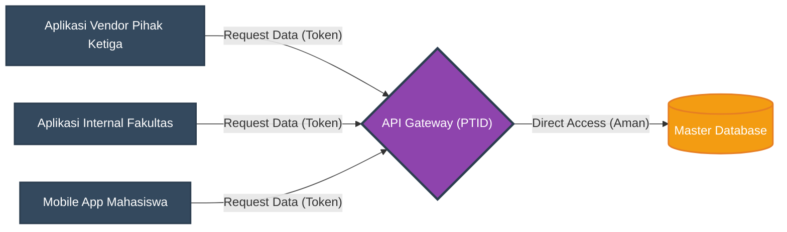

# Arsitektur Integrasi dan API

Pilar paling teknis dari perwujudan Satu Data di IAIN Pontianak adalah penghentian praktik integrasi *point-to-point* (akses basis data langsung antar aplikasi) dan beralih sepenuhnya pada arsitektur berbasis antarmuka pemrograman aplikasi (API).

## Kebijakan API Gateway Terpusat:
1. **API sebagai Jalur Tunggal:** Semua bentuk pertukaran data (pembacaan/penulisan) antar aplikasi—baik antar aplikasi internal maupun dengan aplikasi vendor pihak ketiga—wajib melalui *API Gateway* terpusat yang dikelola PTID.
2. **Larangan *Direct Database Access*:** Aplikasi pihak ketiga (vendor) dilarang keras diberikan koneksi kredensial langsung (seperti *username/password* MySQL/PostgreSQL) ke *Master Data*. Mereka hanya diizinkan mengonsumsi *endpoint API* yang spesifik sesuai kebutuhan layanannya.
3. **Protokol RESTful dan GraphQL:** Integrasi dibangun dengan standar industri modern menggunakan pendekatan *RESTful API* atau *GraphQL*, dengan format pertukaran data baku berupa *JSON (JavaScript Object Notation)*.
4. **Otorisasi API (API Keys / OAuth):** Setiap aplikasi konsumen wajib mendaftarkan sistemnya ke PTID untuk mendapatkan *API Key* atau *Token OAuth 2.0*. PTID berhak membatasi jumlah permintaan (*rate limiting*) atau mencabut token jika terdeteksi aktivitas anomali yang membebani *server*.

## Ilustrasi Arsitektur *API-Led Connectivity* di IAIN Pontianak

Diagram berikut menjelaskan pelarangan *Direct Database Access* dan pemusatan lalu lintas data melalui gerbang API.

